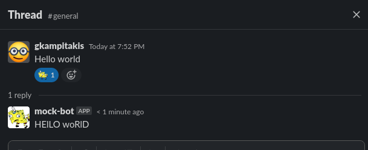

# Mock Slackbot

A slack bot that creates a mock message on demand.

## Description

Mock Slackbot is a bot using [slack-go](https://github.com/slack-go/slack) for communicating with Slack API and [gin](https://github.com/gin-gonic/gin) as a web server.

The job of this slack bot is simple. It monitors reactions on messages that happen
inside public channels that the bot is and if the reaction is `mock` emoji, it replies
on a thread and mocks the message.

<p align="center">
  
</p>

## Details

In the repository is provided `manifest.slack.yaml` for capturing how this bot
can be configured.

There is also a `Makefile` for running common commands like linting, running server
or building the bot.

There is an `.env.mock` where you can copy as `.env` and pass your bot secrets
and run your bot.

```shell
cp .env.mock .env
```

### Local Development

For running mock-slackbot locally you will need a slack workspace where you can 
create and install an app. You will need to create and `.env` file for passing
slack secrets.

After you have configured your slack workspace and obtain the secrets you can start
the server by running `make dev`.

Now it's only left connecting and verifying your server for enabling event subscriptions.
The request url provided to slack needs to be `https`. You can use [ngrok](https://ngrok.com/) for that
by running `ngrok http 8080`.

You can find [here](https://slack.dev/node-slack-sdk/tutorials/local-development)
more information.

### Scopes and API requests

|  Request 	            | Scope  	|
|    :-:	              |  ---	  |
| conversations.history | channels:history, groups:history, im:history, mpim:history |
| chat.postMessage 	    | chat:write                                  |
| users.info  	        | chat:write, chat:write:user, chat:write:bot |
| reactions.add  	      | reactions:write                             |

### Still to do

- [ ] Unit tests
- [ ] Allow bot to join to all public channels
- [ ] Auto join to channels that bot has been removed or newly created ones
- [ ] Mute functionality
- [ ] Respond to mentions
